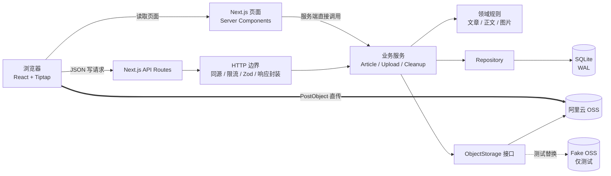
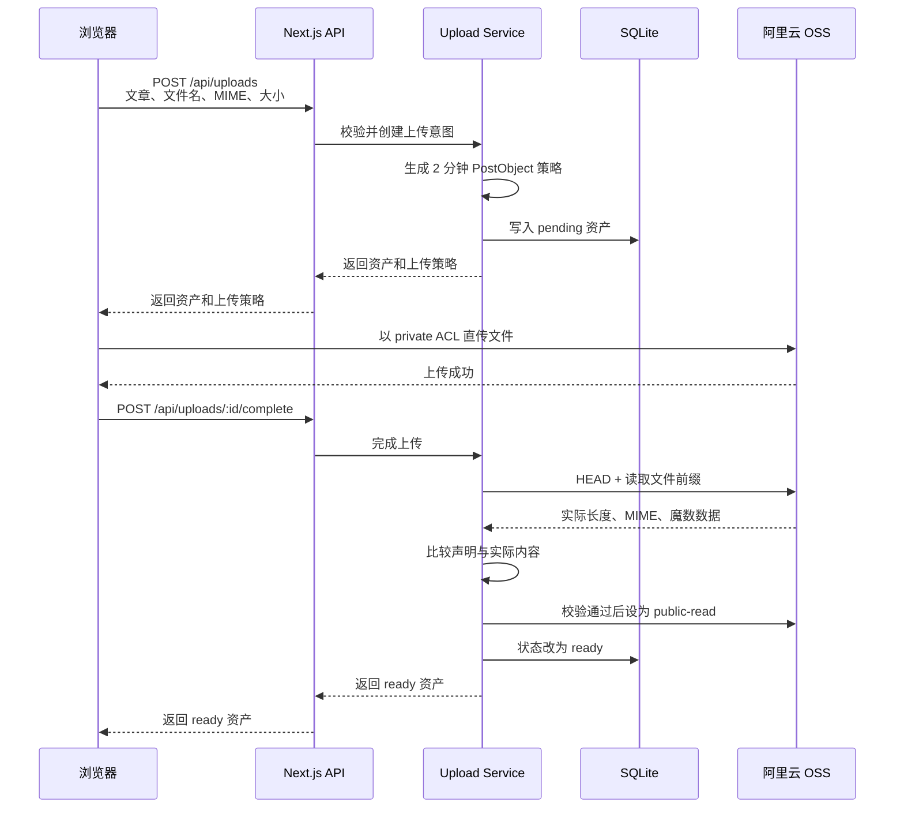

# 字里文章发布系统技术方案（汇报版）

| 项目 | 内容 |
|---|---|
| 项目名称 | 字里文章发布 Demo |
| 方案定位 | 本地优先、可验证的文章发布与图片上传闭环 |
| 技术基线 | Next.js 16.2.10、React 19.2.4、Tiptap 3、SQLite、阿里云 OSS |
| 当前版本 | `0.1.0` |
| 汇报对象 | 技术评审、面试答辩、项目验收 |
| 验证日期 | 2026-07-12 |

> 结论先行：当前版本已经完成文章从草稿、编辑、图片上传、预览、发布到删除和资源清理的单机闭环。系统的核心价值不只是实现编辑器页面，而是处理了并发保存和非可信上传，并针对删除与孤儿资源建立了 SQLite/OSS 跨存储补偿机制。当前没有认证、授权和多用户隔离，适合本机或受限内网演示，不应直接作为公网生产系统。

## 1. 项目背景

文章发布看似是普通 CRUD，但一旦加入富文本和图片，就会同时面对五类问题：

1. 富文本既要保留可编辑结构，又要保证最终展示安全。
2. 图片体积远大于文章元数据，经应用服务器转发会增加带宽、内存和超时压力。
3. 自动保存、多个标签页和连续操作可能互相覆盖数据。
4. SQLite 事务无法与 OSS 操作组成分布式事务，删除失败会产生残留对象。
5. 客户端提供的文件名、MIME、URL 和正文内容都不能直接信任。

因此，本项目把需求拆成三条主链路：

- **文章状态链路**：草稿、自动保存、预览、发布、详情和删除。
- **可信上传链路**：服务端签名、浏览器直传、对象验真、公开读取。
- **资源补偿链路**：引用同步、孤儿识别、删除任务持久化和失败重试。

## 2. 建设目标与范围

### 2.1 本阶段目标

- 支持文章新建、编辑、草稿、预览、发布、详情和删除。
- 使用 Tiptap JSON 保存正文，支持标题、列表、引用、代码块、链接和图片等结构。
- 支持点击、粘贴、拖拽上传图片，并展示上传进度。
- 使用 `revision` 乐观锁阻止静默覆盖。
- 使用浏览器直传 OSS 降低应用服务器的数据传输压力。
- 对上传对象执行服务端二次校验，阻止伪造类型的文件直接公开。
- 对失败上传、孤儿图片和已删除文章的图片提供可重试清理能力。
- 建立单元、集成和端到端三层测试证据。

### 2.2 明确非目标

当前版本不包含以下生产能力：

- 登录、认证、角色授权、文章归属和多租户隔离。
- 审核流、定时发布、版本历史、多人协同和全文检索。
- 多实例部署、分布式限流和高可用数据库。
- 完整的指标、链路追踪、审计和告警平台。

本阶段交付口径是“**受限环境下可验证的完整闭环**”，不是“已经生产化的内容平台”。

## 3. 当前交付成果

| 能力 | 当前实现 | 工程价值 |
|---|---|---|
| 文章生命周期 | 新建、草稿、编辑、预览、发布、详情、删除 | 形成完整业务闭环 |
| 富文本模型 | Tiptap JSON 入库，服务端静态渲染并清洗 HTML | 同时保留可编辑性和展示安全 |
| 图片上传 | 点击、粘贴、拖拽；浏览器直传 OSS | 应用服务不承载图片文件流量 |
| 上传可信度 | 私有上传，校验长度、MIME 和文件魔数后公开 | 不信任客户端声明 |
| 并发保存 | 15 秒自动保存、串行保存队列、revision 乐观锁 | 避免多标签页静默覆盖 |
| 资源一致性 | 文章引用事务同步、删除任务持久化、失败重试 | 控制孤儿对象和跨存储失败 |
| 安全边界 | Zod、同源校验、请求体上限、限流、安全响应头 | 为受限环境提供基础防护 |
| 质量验证 | 98 个 Vitest 测试、桌面和移动端 E2E | 关键规则和主流程可回归 |

## 4. 总体架构

系统采用模块化单体架构。页面、业务服务、领域规则和基础设施适配器在同一个 Next.js 应用中部署，但代码依赖方向保持分层。



### 4.1 分层职责

| 层次 | 主要职责 | 代码位置 |
|---|---|---|
| 页面与组件 | 编辑状态、上传进度、保存提示、路由跳转 | [`app/`](../../app/)、[`components/`](../../components/) |
| API Route | 暴露 HTTP 方法并装配 handler | [`app/api/`](../../app/api/) |
| HTTP 边界 | 同源校验、请求大小、Zod schema、限流、响应 envelope | [`lib/server/http/`](../../lib/server/http/) |
| Service | 编排事务、领域规则和 OSS 副作用 | [`lib/server/services/`](../../lib/server/services/) |
| Domain | 保存文章、正文和图片的不变量 | [`lib/domain/`](../../lib/domain/) |
| Repository | 封装 SQLite 查询和状态持久化 | [`lib/server/db/`](../../lib/server/db/) |
| Storage Provider | 隔离阿里云 OSS 与 fake OSS | [`lib/server/storage/`](../../lib/server/storage/) |

读写路径存在有意的差异：浏览器写操作经过 API 和 HTTP 边界；Server Component 的列表、详情和编辑读取直接复用 service，避免服务端内部再发一次 HTTP 请求。

### 4.2 技术选型与取舍

| 技术 | 选择原因 | 当前代价 |
|---|---|---|
| Next.js 16 + React 19 | 页面、服务端渲染和 API 在一个工程交付 | 当前运行形态依赖 Node，不适合直接放到无状态 Serverless |
| Tiptap 3 | JSON 文档模型可编辑、可扩展，前后端共享扩展定义 | 必须限制节点类型并维护渲染兼容性 |
| SQLite + `node:sqlite` | 零额外数据库服务，事务和本地演示成本低 | 同步 API、单机文件和实验性警告限制扩展能力 |
| 阿里云 OSS PostObject | 浏览器直传，降低应用服务器带宽和内存压力 | 增加 CORS、签名策略、完成确认和对象清理复杂度 |
| Zod | 在 HTTP 和领域边界提供结构化校验 | schema 需要随 API 契约同步维护 |
| Vitest + Playwright | 覆盖纯规则、SQLite 集成和真实浏览器主流程 | 当前真实 OSS 仍依赖人工 smoke test |

## 5. 关键技术设计

### 5.1 富文本内容模型

正文的唯一持久化来源是 Tiptap JSON，而不是客户端生成的 HTML。

- 文档最大 `500 KB`、最多 `5000` 个节点、最大深度 `20` 层。
- 只允许注册过的 node 和 mark 类型。
- 图片节点只保存可信的 `assetId`；保存时由服务端从数据库重新映射公共 URL，忽略客户端伪造的 `src`。
- 展示时由服务端静态渲染，再通过 tag、attribute 和 URL scheme 白名单清洗。
- 外链统一补充 `noopener noreferrer nofollow`。

这套设计把“编辑结构”和“展示 HTML”分离：JSON 负责长期可编辑，清洗后的 HTML 负责安全展示。实现证据见 [`article-content.ts`](../../lib/domain/article-content.ts) 和 [`render.ts`](../../lib/rich-text/render.ts)。

### 5.2 自动保存与并发控制

客户端每 `15` 秒检查脏状态，保存过程串行执行。预览和发布会等待正在进行的图片上传与保存，避免正文引用尚未完成的资产。

每次更新携带 `expectedRevision`，数据库执行：

```sql
UPDATE articles
SET ..., revision = revision + 1
WHERE id = ? AND revision = ?;
```

若受影响行数为 `0`，服务端区分文章不存在和版本冲突；版本冲突返回 `REVISION_CONFLICT`，客户端进入明确的冲突状态，而不是覆盖新数据。实现见 [`article-repository.ts`](../../lib/server/db/article-repository.ts) 和 [`article-composer.tsx`](../../components/editor/article-composer.tsx)。

当前产品语义需要特别说明：自动保存使用 `draft` 动作，编辑已发布文章后会回到草稿状态并从公开详情页下线。这对 Demo 是明确且简单的规则；生产内容平台通常应拆分“线上已发布快照”和“编辑中版本”。

### 5.3 图片可信直传



上传防线分为四层：

1. 客户端提前校验，改善反馈速度，但不作为信任依据。
2. 服务端校验文件名、扩展名、MIME 和大小；支持 JPEG、PNG、WebP、GIF，单图最大 `5 MB`。
3. OSS 策略有效期 `2` 分钟，严格限制 Bucket、对象 key、MIME、大小、`private` ACL，并禁止覆盖已有对象。
4. 完成接口重新检查对象长度、Content-Type 和文件魔数，全部一致后才公开并标记 `ready`。

文章保存时，正文与封面合计最多引用 `20` 个唯一资产。上传意图当前没有文章级资产总量配额，因此用户可以先上传更多对象，但超出引用上限的对象不能随文章保存，后续由孤儿资源清理处理。

对象 key 使用 `posts/{articleId}/{assetId}.{ext}`，既能按文章归类，也避免直接使用用户文件名导致覆盖和路径注入。实现见 [`image-policy.ts`](../../lib/domain/image-policy.ts)、[`oss-policy.ts`](../../lib/server/storage/oss-policy.ts) 和 [`upload-verification.ts`](../../lib/server/storage/upload-verification.ts)。

### 5.4 SQLite 与 OSS 的一致性

SQLite 事务无法与 OSS 组成原子事务，因此系统采用“数据库先记账、外部副作用后执行、失败持久化补偿”的最终一致性方案。

文章删除流程：

1. 在 SQLite 事务内为相关对象写入 `asset_delete_jobs`。
2. 删除文章及资源引用并提交事务。
3. 尝试删除 OSS 对象。
4. 成功后删除任务；失败后记录错误和下一次执行时间。

清理服务还会处理两类遗留资产：

- `pending` 超过 `24` 小时仍未完成的上传。
- `ready` 但失去文章引用超过 `1` 小时的孤儿资产。

当前失败重试固定延迟 `60` 秒，不是指数退避；清理由新上传意图机会触发，或通过 `pnpm cleanup:assets` 手工执行。生产环境需要独立调度器、指数退避、最大重试次数、死信和告警。

上传完成也存在一个明确的跨存储窗口：当前顺序是先把 OSS 对象设为 `public-read`，再把数据库资产标记为 `ready`。如果第二步失败，会暂时出现“OSS 已公开、数据库仍为 pending”的状态；客户端重试完成接口可以再次校验并收敛，未重试的对象最终按 pending 资产清理。生产环境还应增加状态对账、幂等恢复和异常告警，不能把当前方案表述为跨存储强一致。

### 5.5 数据库配置

SQLite 当前启用：

- 外键约束，避免失效引用。
- `busy_timeout = 5000`，缓解短时写锁竞争。
- WAL，提高单机读写并行能力。
- 文章状态、资产归属和清理任务到期时间索引。
- `BEGIN IMMEDIATE / COMMIT / ROLLBACK` 显式事务。

这些设置适合单进程、低并发的本地或内网场景，但不能替代生产容量测试，也不能支持无状态多实例扩容。

## 6. 数据模型与 API

### 6.1 核心数据表

| 表 | 关键字段 | 用途 |
|---|---|---|
| `articles` | content JSON、content text、status、revision、cover、timestamps | 保存文章和并发版本 |
| `assets` | article、object key、MIME、size、status、orphaned time | 跟踪上传对象全生命周期 |
| `article_assets` | article、asset、role、position | 表达正文和封面引用，限制单封面 |
| `asset_delete_jobs` | object key、attempts、next attempt、last error | 持久化跨存储补偿任务 |

完整 schema 见 [`database.ts`](../../lib/server/db/database.ts)。

### 6.2 HTTP API

| 方法 | 路径 | 用途 |
|---|---|---|
| `GET` | `/api/articles` | 按状态分页查询文章 |
| `POST` | `/api/articles` | 创建空草稿 |
| `GET` | `/api/articles/:id` | 查询文章详情 |
| `PATCH` | `/api/articles/:id` | 保存草稿或发布文章 |
| `DELETE` | `/api/articles/:id` | 删除文章并安排资源清理 |
| `POST` | `/api/uploads` | 创建上传意图和签名策略 |
| `POST` | `/api/uploads/:id/complete` | 验证对象并完成上传 |

API 使用统一 envelope：

```json
{
  "success": true,
  "data": {},
  "meta": {}
}
```

```json
{
  "success": false,
  "error": {
    "code": "REVISION_CONFLICT",
    "message": "文章已在其他页面更新"
  }
}
```

未知异常只向客户端返回通用 `500` 消息，详细错误保留在服务端日志，避免泄露内部实现。

## 7. 安全方案与边界

### 7.1 已实现控制

| 风险 | 当前控制 |
|---|---|
| 非法 JSON / 超大请求 | 仅接受 JSON，同时检查声明长度和实际 UTF-8 长度，上限 `600 KB` |
| 跨站写请求 | 写操作精确校验 `Origin` 与 `APP_ORIGIN` |
| 参数绕过 | 请求体和查询参数使用 schema；正文与资产再执行领域校验；路径 ID 当前按存在性查找 |
| XSS | 受限 Tiptap 结构、服务端 HTML 白名单、链接协议限制 |
| 文件伪装 | 扩展名、MIME、OSS 元数据、实际长度、文件魔数联合校验 |
| 对象抢占 | UUID key、短期策略、禁止覆盖、先 private 后 public |
| 浏览器攻击面 | CSP、Referrer-Policy、nosniff、frame deny、Permissions-Policy、COOP |
| 密钥泄露 | OSS 凭证只从服务端环境变量读取，禁止 `NEXT_PUBLIC_` 和代码提交 |
| 错误信息泄露 | 统一错误映射，未知错误返回通用消息 |

### 7.2 当前不能承诺的安全能力

- 没有认证和授权，任何能访问服务的人都能修改或删除文章。
- 限流保存在单进程内存中；普通 API 与上传 API 各有一个限流器，但每个限流器内所有客户端共享同一 `local` 桶。进程重启会清空，多实例也不共享。
- OSS 配置采用懒加载，错误可能到首次上传时才暴露。
- CSP 仍允许 inline script/style，未形成 nonce/hash 严格策略。
- 项目自身未提供 HSTS；公网 HTTPS 入口也尚未纳入本方案实现。
- 没有审计日志、密钥轮换流程和自动依赖/密钥扫描。

因此，“已有基础安全防线”和“具备公网生产安全”必须在汇报中严格区分。

## 8. 测试与质量保证

### 8.1 2026-07-12 本机验证结果

| 检查项 | 结果 |
|---|---|
| Vitest | `21` 个测试文件、`98` 个测试全部通过 |
| Statements | `90.97%` (`474/521`) |
| Branches | `84.56%` (`252/298`) |
| Functions | `97.27%` (`107/110`) |
| Lines | `92.14%` (`446/484`) |
| Playwright E2E | 同一主流程在 desktop Chromium、mobile Chromium 各执行 `1` 次，均通过 |
| TypeScript | `pnpm typecheck` 通过 |
| ESLint | `pnpm lint` 通过 |
| Production build | `pnpm build` 通过 |

覆盖率阈值对 statements、branches、functions、lines 均设置为 `80%`。统计范围主要是 `lib/**/*.ts` 和上传客户端，并非整个仓库；绝大多数页面和 UI 组件、runtime、真实 OSS provider 不在覆盖率统计范围内，不能把上述数字表述为“全仓覆盖率”。

### 8.2 测试分层

- **单元测试**：领域限制、Tiptap 结构、HTML 清洗、OSS 策略、组件交互。
- **集成测试**：SQLite repository、service、HTTP handler、上传和清理补偿。
- **E2E 测试**：桌面和移动端执行创建、正文/封面上传、保存、预览、发布、草稿访问控制和删除。

E2E 使用独立 SQLite 和 fake OSS，不读取真实云端密钥。这样保证回归稳定，但真实 OSS 的 Bucket、CORS、ACL 和网络行为仍需在发布前执行 smoke test。

### 8.3 质量门禁改进

当前 `test:all` 只串联覆盖率与 E2E，仓库未配置 CI。建议把以下步骤变成每次合并的自动门禁：

```powershell
pnpm lint
pnpm typecheck
pnpm test:coverage
pnpm build
pnpm test:e2e
```

同时增加依赖漏洞扫描、密钥扫描、真实测试 Bucket smoke test 和失败场景 E2E。

## 9. 部署与运维方案

### 9.1 当前支持的部署形态

当前推荐单机 Node 部署：

```text
浏览器
  -> HTTPS 反向代理
  -> 127.0.0.1 上的 Next.js Node 进程
       -> 本地持久卷 SQLite
       -> 阿里云 OSS
```

必要条件：

- Node.js `22.13+`、pnpm `10`。
- SQLite 文件目录使用持久卷，并具备备份能力。
- `APP_ORIGIN` 与用户实际访问源完全一致。
- OSS Bucket、CORS、ACL 和 RAM 权限按最小权限配置。
- Node 进程由进程管理器托管并保留 stdout/stderr。
- 定时执行资源清理脚本，而不是只依赖上传时机会触发。

### 9.2 构建与启动

```powershell
pnpm install
pnpm build
pnpm start
```

核心环境变量见 [环境变量参考](../5-CONFIGURATION/environment-variables.md)。敏感变量必须由部署环境注入，不得写入仓库、镜像或前端变量。

### 9.3 发布检查

1. 备份 SQLite 文件并验证备份可读。
2. 执行 lint、typecheck、coverage、build 和 E2E。
3. 启动后访问首页并调用 `GET /api/articles`。
4. 创建一篇草稿，完成一次真实 OSS 图片上传。
5. 验证图片上传前为 private、完成后可读。
6. 删除测试文章，确认数据库记录和 OSS 对象均被清理。
7. 检查日志中是否出现未处理异常或清理失败。

当前没有独立 health endpoint，健康检查只能使用首页和文章 API smoke check；这是生产化前需要补齐的运维能力。

### 9.4 备份与恢复

- 升级前停止写入或进入维护窗口，再备份 SQLite 主文件及相关 WAL 状态。
- OSS 建议启用版本控制或生命周期策略，避免误删不可恢复。
- 恢复演练需要同时验证文章数据、资源引用和 OSS 对象，而不是只恢复数据库文件。
- 恢复目标 RPO/RTO 尚未定义，公网化前应由业务方给出并通过演练验证。

## 10. 公网化阻断与演进风险

| 公网化优先级 | 风险 | 当前影响 | 处理建议 |
|---|---|---|---|
| P0 | 无认证、授权和资源归属 | 任意访问者可修改全部内容 | 接入认证、RBAC、文章归属和审计 |
| P0 | 进程内分类限流 | 每个限流器内客户端共享桶，重启丢失，多实例不共享 | Redis 持久化限流，按用户/IP/接口分桶 |
| P0 | 长期 OSS 密钥使用风险 | 泄露后影响 Bucket | 优先 STS/RAM Role、KMS 托管和轮换 |
| P1 | 同步本地 SQLite | 阻塞事件循环，无法水平扩容 | PostgreSQL、连接池和正式迁移框架 |
| P1 | 已发布文章编辑后自动下线 | 线上内容与编辑稿没有隔离 | 增加 published snapshot / working copy |
| P1 | 清理无常驻调度 | 低上传量下孤儿对象可能长期滞留 | 独立 worker、定时调度、指标和告警 |
| P1 | 上传公开与 ready 入库非原子 | 入库失败时对象可能已公开但仍显示 pending | 幂等恢复、周期对账、异常告警，评估先入库过渡态 |
| P1 | 固定 60 秒重试 | 持续故障时缺少退避和死信 | 指数退避、最大次数、死信队列 |
| P1 | 启动即建表，无 schema version | 升级和回滚不可审计 | 引入版本化迁移工具和变更记录 |
| P1 | 可观测性不足 | 故障定位和审计困难 | 结构化日志、request ID、metrics、trace、health |
| P2 | E2E 使用 fake OSS | 云端 CORS、ACL、网络兼容性存在盲区 | 独立测试 Bucket 的发布前 smoke test |
| P2 | CSP 允许 inline | 公网 XSS 防护仍可收紧 | 结合 Next.js 使用 nonce/hash CSP |
| P2 | 缺少容量数据 | 无法给出可信并发和资源规格 | 建立上传、保存、列表和清理基准测试 |

## 11. 分阶段演进路线

### 阶段 A：单机闭环（当前已完成）

- 完成文章与图片全生命周期。
- 实现乐观锁、对象验真和持久化删除任务。
- 单元、集成、桌面/移动端 E2E 达到可回归状态。
- 明确仅限本机或受限内网使用。

### 阶段 B：安全内网版

- 接入统一身份认证、安全会话、CSRF 防护、角色权限和文章归属。
- 使用 STS/RAM Role 取代长期高权限密钥。
- 增加结构化日志、request ID、审计、health/readiness。
- 增加正式数据库迁移、定时清理和备份恢复演练。
- 建立 CI 门禁和真实 OSS smoke test。

验收标准：未授权访问被拒绝；权限越界测试通过；备份可恢复；清理失败可告警；每次合并自动执行完整质量门禁。

### 阶段 C：公网生产版

- SQLite 迁移 PostgreSQL，限流迁移 Redis。
- 清理任务迁移到独立 worker/队列，支持指数退避和死信。
- 引入发布快照、历史版本和审核流程。
- 完成监控、告警、容量测试、SLO、RPO/RTO 和故障演练。
- 评估私有 Bucket + CDN/签名 URL，减少永久公开对象。

验收标准：支持多实例；关键指标和告警可观测；容量测试达到约定目标；故障恢复满足 SLO；安全评审无阻断项。

## 12. 汇报与演示建议

### 12.1 10 分钟汇报结构

| 时间 | 内容 | 建议表达 |
|---|---|---|
| 1 分钟 | 项目定位 | 这不是单一上传控件，而是文章、对象存储和资源回收的完整链路 |
| 2 分钟 | 总体架构 | 模块化单体、读写路径、SQLite 与 ObjectStorage 抽象 |
| 3 分钟 | 现场演示 | 新建 -> 编辑 -> 上传 -> 预览 -> 发布 -> 删除 |
| 2 分钟 | 三个技术亮点 | revision 乐观锁、私有上传后二次验真、持久化补偿任务 |
| 1 分钟 | 质量证据 | 98 个测试、四项覆盖率、桌面和移动 E2E、构建通过 |
| 1 分钟 | 边界与路线 | 当前受限环境可用，公网化先补身份、共享状态和可运维性 |

### 12.2 推荐演示路径

1. 从首页创建草稿，说明草稿先落库再进入编辑器。
2. 输入标题、摘要、标签和正文，展示 15 秒自动保存状态。
3. 上传正文图片和封面，展示进度、图片说明和布局控制。
4. 打开预览，再返回编辑，说明预览前会等待最新保存完成。
5. 发布并打开公开详情，说明只有 `published` 状态可公开访问。
6. 打开两个标签页制造 revision 冲突，展示系统拒绝静默覆盖。
7. 删除文章并说明数据库任务与 OSS 清理的补偿机制。

### 12.3 可直接使用的开场和收尾

开场：

> 这个项目表面上是文章上传，核心其实是一次跨浏览器、数据库和对象存储的状态一致性设计。我把问题拆成文章并发、上传可信边界和资源回收三条链路。

收尾：

> 当前版本完成的是受限环境下可验证的工程闭环。进入公网前，优先级最高的不是继续增加编辑器功能，而是补齐身份权限、共享状态、可观测性和恢复能力。

### 12.4 常见追问

**为什么保存 JSON，而不是直接保存 HTML？**

JSON 保留可编辑结构，便于升级节点和重新渲染；HTML 只作为展示产物，并在服务端重新生成和清洗。

**为什么不让应用服务器接收图片？**

浏览器直传可以减少应用带宽、内存占用和大文件超时，但必须配合短期策略和服务端完成校验。

**数据库和 OSS 删除如何保证一致？**

两者不能原子提交，所以先在数据库持久化删除任务，再执行 OSS 副作用；失败留下任务重试，采用最终一致性。

**多个标签页同时编辑怎么办？**

每次保存携带 revision，数据库只更新匹配版本；不匹配就返回冲突，不静默覆盖。

**为什么当前不能直接上公网？**

因为身份、权限、共享限流、审计、健康检查和恢复能力尚未完成。基础输入安全不等于生产安全。

**后续如何扩容？**

把本地 SQLite 迁移到 PostgreSQL，把进程内限流迁移到 Redis，把清理任务迁移到独立队列和 worker，使应用节点无状态化。

## 13. 代码证据索引

| 主题 | 证据 |
|---|---|
| 15 秒自动保存与保存队列 | [`article-composer.tsx`](../../components/editor/article-composer.tsx) |
| revision 条件更新 | [`article-repository.ts`](../../lib/server/db/article-repository.ts) |
| 文章事务与删除补偿 | [`article-service.ts`](../../lib/server/services/article-service.ts) |
| 上传意图和完成确认 | [`upload-service.ts`](../../lib/server/services/upload-service.ts) |
| 上传策略约束 | [`oss-policy.ts`](../../lib/server/storage/oss-policy.ts) |
| 文件内容验真 | [`upload-verification.ts`](../../lib/server/storage/upload-verification.ts) |
| Tiptap 文档边界 | [`article-content.ts`](../../lib/domain/article-content.ts) |
| 服务端 HTML 清洗 | [`render.ts`](../../lib/rich-text/render.ts) |
| SQLite schema 与事务 | [`database.ts`](../../lib/server/db/database.ts) |
| 请求安全和限流 | [`request-security.ts`](../../lib/server/http/request-security.ts) |
| 安全响应头 | [`next.config.ts`](../../next.config.ts) |
| 测试阈值与范围 | [`vitest.config.mts`](../../vitest.config.mts) |
| 桌面/移动 E2E 配置 | [`playwright.config.ts`](../../playwright.config.ts) |

更细的安装、配置、排障和 API 说明见[文档总入口](../index.md)。
